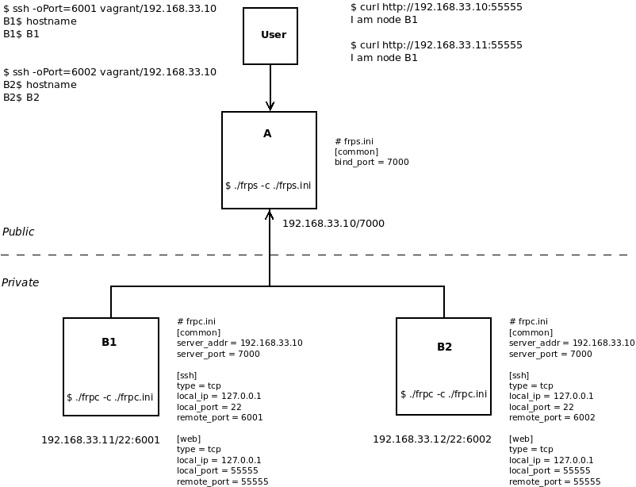

# frp Demo
This vagrant file creates 3 VMs to demo [frp](https://github.com/fatedier/frp).
In this demo we want to ssh private servers (B1 and B2) using a public server (A)

To do this, please follow:

- From your machine run: `$ vagrant up`
- Open 3 terminals one for A and two for B1 and B2.
- In the 1st terminal run: `$ vagrant ssh A`
- and `vagrant@A:~$ ./frp_0.46.0_linux_amd64/frps -c ./frp_0.46.0_linux_amd64/frps.ini`
- In the 2nd terminal run: `$ vagrant ssh B1`
- and `vagrant@B1:~$ ./frp_0.46.0_linux_amd64/frpc -c ./frp_0.46.0_linux_amd64/frpc.ini`
- In the 3rd terminal run: `$ vagrant ssh B2`
- and `vagrant@B2:~$ ./frp_0.46.0_linux_amd64/frpc -c ./frp_0.46.0_linux_amd64/frpc.ini`
- Open a new terminal and run: `$ ssh -oPort=6001 vagrant@192.168.33.10`, `vagrant/vagarnt` is username/password and `192.168.33.10` is the public address of A.
- You should notice that you accessed B1 from A, to double check run: `vagrant@B1:~$ hostname`
- You can do the same to access B2 from A, but run: `$ ssh -oPort=6002 vagrant@192.168.33.10`
- To stop the demo and remove the VMs, run: `$ vagrant destroy -f`

