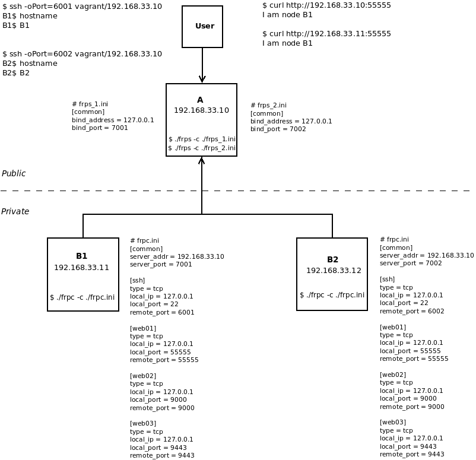

# frp Demo
This vagrant file creates 3 VMs to demo [frp](https://github.com/fatedier/frp).
In this demo we want to:
- ssh private servers (B1 or B2) using a public server (A)
- access web server running on (B1 or B2) using a public server (A)

To do this, please follow:

- From your machine run: `$ vagrant up`
- Open 3 terminals one for A and two for B1 and B2.
- In the 1st terminal run: `$ vagrant ssh A`
- and `vagrant@A:~$ ./frp_0.46.0_linux_amd64/frps -c ./frp_0.46.0_linux_amd64/frps_1.ini`, and `vagrant@A:~$ ./frp_0.46.0_linux_amd64/frps -c ./frp_0.46.0_linux_amd64/frps_2.ini`
- In the 2nd terminal run: `$ vagrant ssh B1`
- and `vagrant@B1:~$ ./frp_0.46.0_linux_amd64/frpc -c ./frp_0.46.0_linux_amd64/frpc.ini`
- In the 3rd terminal run: `$ vagrant ssh B2`
- and `vagrant@B2:~$ ./frp_0.46.0_linux_amd64/frpc -c ./frp_0.46.0_linux_amd64/frpc.ini`
- Open a new terminal and run: `$ ssh -oPort=6001 vagrant@192.168.33.10`, `vagrant/vagarnt` is username/password and `192.168.33.10` is the public address of A.
- You should notice that you accessed B1 from A, to double check run: `vagrant@B1:~$ hostname`
- You can do the same to access B2 from A, but run: `$ ssh -oPort=6002 vagrant@192.168.33.10`
- if you have [generated an ssh key pair](https://www.digitalocean.com/community/tutorials/how-to-configure-ssh-key-based-authentication-on-a-linux-server) to access B1 from A without input password, you could access B1 from A as: `vagrant@A:~$ ssh -o StrictHostKeyChecking='no' -i /home/vagrant/.ssh/id_rsa vagrant@127.0.0.1` whereas `id_rsa` is the private key. 
- Also, you can run a web service from B1 (or B2), for example to run a simple web server: `vagrant@B1:~$ docker compose -f /vagrant/docker-compose.yaml up -d`
- From your machine you can access this server (running in B1) from A: `$ curl http://192.168.33.10:55555`
- Alternatively, you could run `portainer` on B1 (or B2): `vagrant@B1:~$ docker run -d -p 8000:8000 -p 9443:9443 -p 9000:9000 --name portainer --restart=always -v /var/run/docker.sock:/var/run/docker.sock -v portainer_data:/data portainer/portainer-ce:latest --http-enabled`
- From a browser at your machine, you can access `portainer` using A address: `http://192.168.33.10:9000` or `https://192.168.33.10:9443`
- To stop the demo and remove the VMs, run: `$ vagrant destroy -f`

